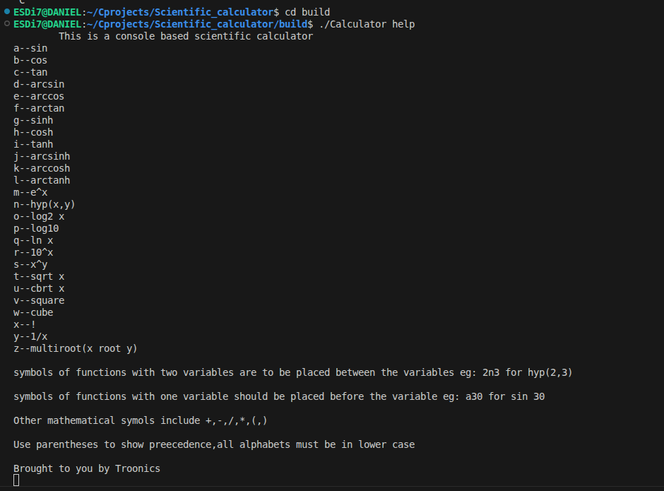
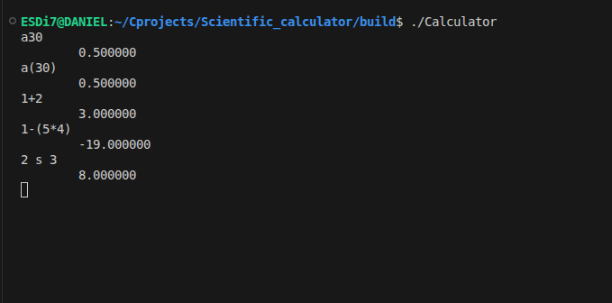
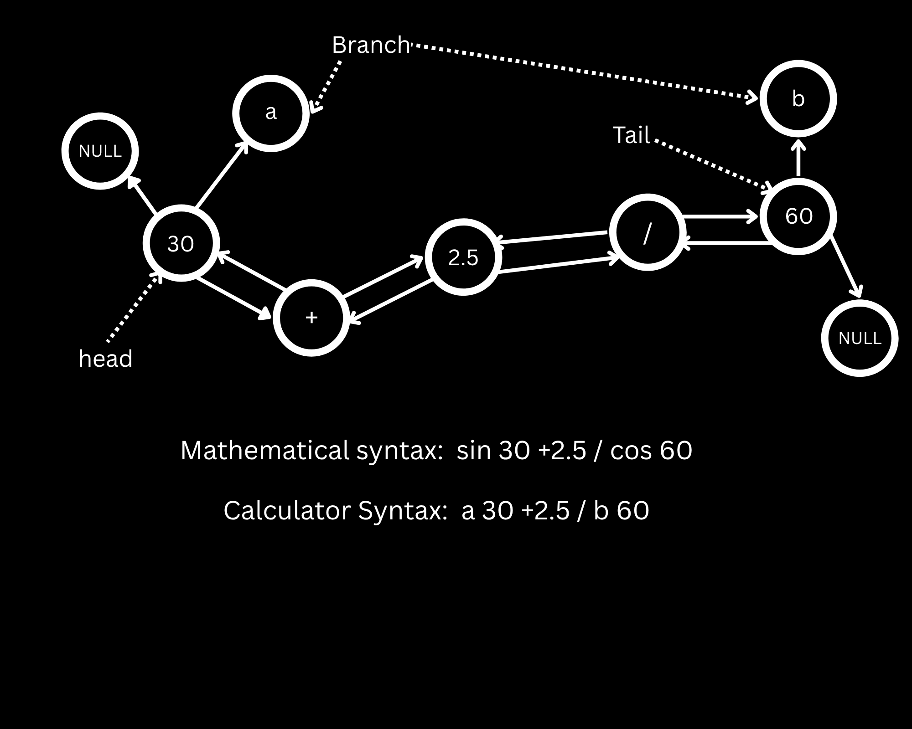
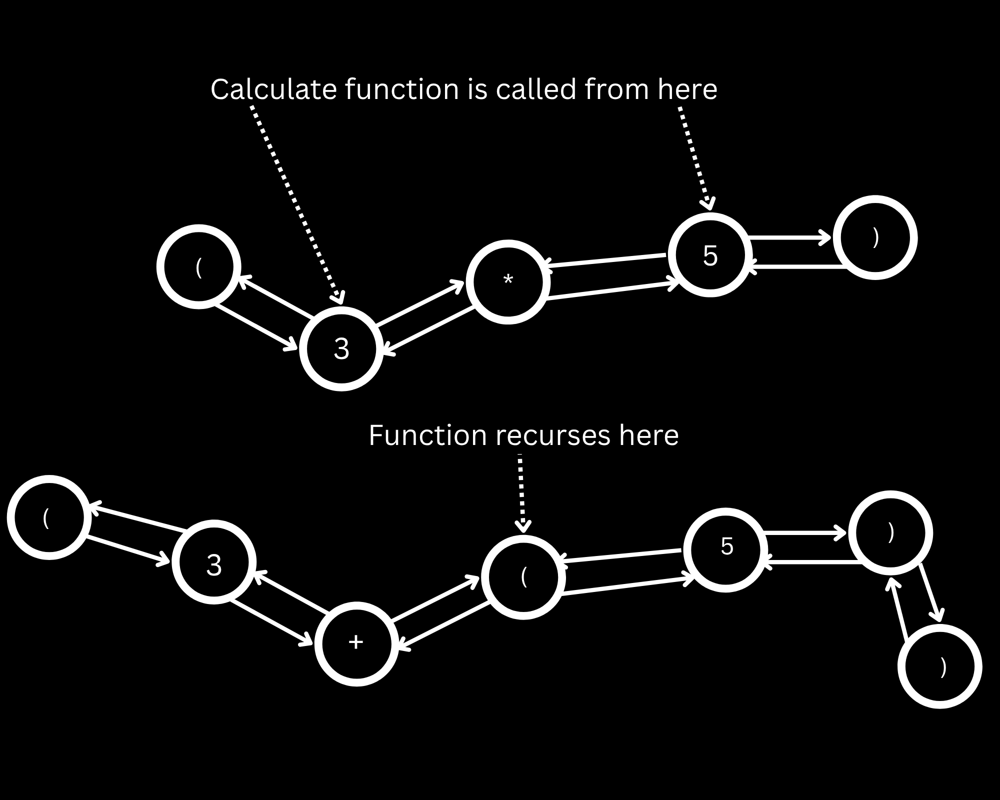

# SCIENTIFIC CALCULATOR

A lightweight, terminal-based scientific calculator built entirely in **C**.This Console based scientific calculator uses the  `math.h` library to perform special operations,it also performs arithmetic operations.
The aim of this project is to master pointers,linked lists and self referential structures.


## Special Functions OP-code

| Function | character(op-code) | Syntax |
| :--- | :--- | :--- |
| **Sin x** | `'a'` | ax or a(x) |
| **cos x** | `'b'` | bx or b(x) |
| **Tan x** | `'c'` | cx or c(x) |
| **Sin<sup> -1</sup> x** | `'d'` | dx or d(x) |
| **Cos<sup> -1</sup> x** | `'e'` | ex or e(x) |
| **Tan<sup> -1</sup> x** | `'f'` | fx or f(x) |
| **Sinh x** | `'g'` | gx or g(x) |
| **Cosh x** | `'h'` | hx or h(x) |
| **Tanh x** | `'i'` | ix or i(x) |
| **Sinh<sup> -1</sup> x**| `'j'` | jx or j(x) |
| **Cosh<sup> -1</sup> x** | `'k'` | kx or k(x) |
| **Tanh<sup> -1</sup> x** | `'l'` | lx or l(x) |
| **e<sup>x</sup>** | `'m'` | mx or m(x) |
| **Hyp ( x , y )** | `'n'` | x `n` y |
| **Log<sub>2</sub> x** | `'o'` | ox or o(x) |
| **Log<sub>10</sub> x**| `'p'` | px or p(x) |
| **ln x** | `'q'` | qx or q(x) |
| **10<sup>x</sup>**| `'r'` | rx or r(x) |
| **x<sup>y</sup>** | `'s'` | x `s` y |
| **&#8730; x** | `'t'` | tx or t(x) |
| **&#8731; x** | `'u'` | ux or u(x) |
| **x<sup>2</sup>** | `'v'` | vx or v(x) |
| **x<sup>3</sup>**| `'w'` | wx or w(x) |
| **x !** | `'x'` | x`x` or `x`(x) |
| **x<sup>-1</sup>** | `'y'` | yx or y(x) |
| **<sup>x</sup>&#8730; y** | `'z'` | x `z` y |

**Note:** Operators that require two operators are placed between the operands
## Arithmetic and parenthesis
| Operation | character(op-code) |
| :--- | :--- |
| **+** | `'+'` |
| **-** | `'-'` |
| **x** | `'*'` | 
| **&divide;** | `'/'` | 
| **(** | `'('` |
| **)** | `')'` |

**Note:** Use parentheses to show precedence

## Installation and  Build
This project uses a `Makefile` for easy compilation.


### Prerequisites
* A C compiler (GCC, Clang, or MinGW)
* GNU Make

### Building the Project
1. Clone the repository:
   ```bash
   git clone https://github.com/Dani-uC/Scientific_calculator.git

   cd Scientific_calculator

2. Build with make:
   ```bash
   make 

   cd build

3. Run the program:


```bash
./Calculator #linux or MacOS

./Calulator.exe #windows


   ```






## Documentation

### getInput:
 The process begins from the `getInput` function. Input is taken from the console using `fgets` and is stored in `local buffer` array of strings, after which it is copied into the argument (buffer), while copying , escape sequence and white spaces are removed.

### syntaxCheck:
This function takes in the buffer and makes sure that the mathematical syntax are in a form that can be parsed and estimaded by the calculator

### listFormer:
This function takes in the buffer array and parses it into a doubly linked list.each number,operator and parenthesis are placed in a new node.

The list is linked in such a way that all operators that require two operands and operands are in the main list.while a branch node is attached to operands that require special functions of single variable as a singly linked list.




`NULL` tells the loops where the list ends while trasversing

### addMultiplication:
This function add multiplication between numbers and `(` and also between numbers.

```bash
2(4) --- 2*(4)
5a30 --- 5*a30
```
**note:** It doesn't add multiplication to special function operators that require two operands `n s and z` .

### Calculate:
This function takes two point in the doubly linked,resolves them and stores the answer in the starting node.It does not account for parentheses but resolves all special functions and arithmetic operations by calling other functions.

After storing the answer the lists is reorganized to bypass nodes that are no longer relevant (operators and the second operands),After which the bypassed and branch nodes are freed.

### estimate:
This is a recursive function that invokes itself whenever it meets a `(` node.The `(` node represent the begining of a new scope, The estimate function trasverses the list and stops whenever it reaches the `)` node and then calls the calculate function from the node after `(` to the node before `)` OR it recurses if it hits a `(` before the respective `)`.

This recursion accounts for nested and multiple parentheses scope,note that the parentheses amount must be even and each `(` must have a respective `)`

If there are no parentheses in the list it just calls the calculate function and return the answer to the main function.


